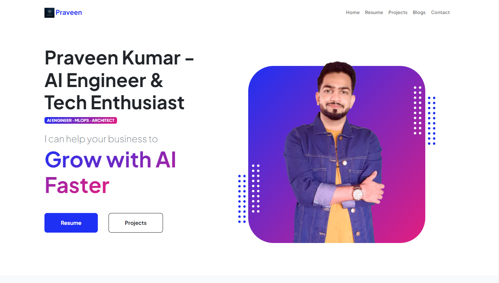

# [Hello, world! 👋 I'm Praveen Kumar (PK)](https://github.com/inboxpraveen#hello-world--im-praveen-kumar-pk)

🛠 **Senior AI Architect** | 🎤 **Educator** | ✍️ **Tech Blogger**

I'm based in the heart of innovation, **Silicon Valley of India - Bengaluru**. Building scalable AI products, diving deep into natural language processing, speech recognition, and computer vision, and sharing my knowledge with the world is what I live for. Let's make the tech community stronger, together!

This is my portfolio website. Just to put everything on a single site.

## Checkout the website [HERE](https://inboxpraveen.github.io)

### Sample Screenshot

